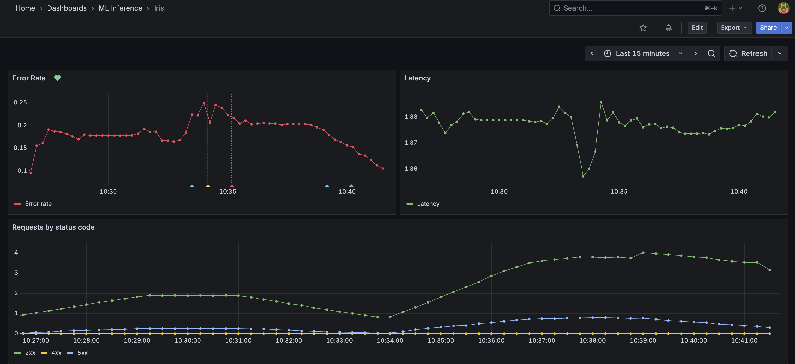
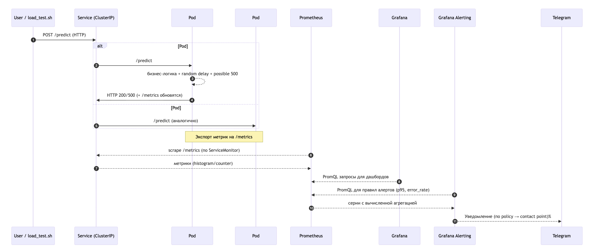
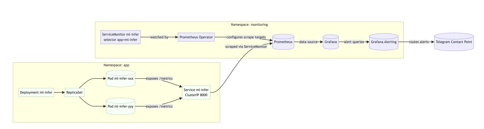

# Практика: алерты и метрики в Kubernetes

## 1. Запуск Minikube
Поднимаем локальный кластер Kubernetes:
```bash
minikube start --memory=6g --cpus=4
```

---

## 2. Установка Prometheus + Grafana
Ставим **kube-prometheus-stack** через Helm:
```bash
helm repo add prometheus-community https://prometheus-community.github.io/helm-charts
helm repo update
kubectl create ns monitoring

helm install kps prometheus-community/kube-prometheus-stack \
  --namespace monitoring \
  --set grafana.adminPassword='admin' \
  --set prometheus.prometheusSpec.scrapeInterval='15s'
```

Делаем портфорварды:
```bash
kubectl -n monitoring port-forward svc/kps-grafana 3000:80
kubectl -n monitoring port-forward svc/kps-kube-prometheus-stack-prometheus 9090:9090
```

- Grafana → [http://localhost:3000](http://localhost:3000) (логин/пароль: `admin/admin`)  
- Prometheus → [http://localhost:9090](http://localhost:9090)  

---

## 3. Сборка Docker-образа приложения
Чтобы ноды Minikube увидели образ, подключаемся к Docker демону Minikube:
```bash
eval $(minikube -p minikube docker-env)
```

Собираем образ:
```bash
docker build -t ml-infer:0.1 .
```

> Если не переключить окружение, Minikube не найдёт образ и будет пытаться скачать его из DockerHub → ошибка `pull access denied`.

---

## 4. Деплой приложения в Kubernetes
Применяем манифесты:
```bash
kubectl apply -f k8s/deployment.yaml
kubectl apply -f k8s/service.yaml
kubectl apply -f k8s/servicemonitor.yaml
```

Проверяем, что поды запустились:
```bash
kubectl get pods
kubectl rollout status deploy/ml-infer
```

Делаем портфорвард, чтобы можно было стучаться в API:
```bash
kubectl port-forward svc/ml-infer 8080:8000
```

Теперь приложение доступно на [http://localhost:8080](http://localhost:8080).

---

## 5. Генерация нагрузки
Скрипт `load_test.sh` отправляет запросы на `/predict`:
```bash
chmod +x load_test.sh
./load_test.sh 8080 200
```

- Часть запросов **намеренно падает с 500** (см. `ERROR_RATE` в манифесте).  
- Также есть **рандомные задержки** (см. `MAX_DELAY`), чтобы наблюдать рост latency.  

---

## 6. Метрики и дашборды
В Grafana создаём новый дашборд с панелями:  

- **Error Rate**
```promql
sum(increase(prediction_errors_total[5m]))
/ sum(increase(prediction_requests_total[5m]))
```
Показывает процент запросов, закончившихся 500-ками.  

- **Latency p95**
```promql
histogram_quantile(0.95, sum(rate(prediction_latency_seconds_bucket[5m])) by (le))
```
95% запросов укладываются в это время. Если значение > 1–2 секунд, значит сервис деградирует.  

- **HTTP общая статистика**
```promql
sum by (status) (rate(http_requests_total[5m]))
```
Сколько запросов прошло с разными кодами (200, 500 и т.д.).  

---

## 7. Настройка алерта в телеграм (персонально)

1. Создаем правило аалерта 
2. Задаем Contact point
3. Задаем Notification policies

```
- Chat name: @alerts_lesson_otus
- Token: 7429516373:AAG_FUr_RhcWa84QBTUc3s-36_TfkApT_Lc
- Chat Id: -1002557784841
```
[Инструкция по созданию чата и получению информации о нем](https://gist.github.com/nafiesl/4ad622f344cd1dc3bb1ecbe468ff9f8a]

--- 

## 8. Что мы сделали
1. Подняли кластер Kubernetes с Minikube  
2. Установили Prometheus + Grafana для мониторинга  
3. Развернули FastAPI приложение с метриками и «инъекцией проблем»  
4. Настроили сбор метрик приложения через ServiceMonitor  
5. Сгенерировали нагрузку и построили дашборд в Grafana
6. Настроили алерты в телеграм по Error rate

#### Пример dashboard мониторинга микросервиса


#### Dataflow


#### K8S Prometheus & Grafana stack
